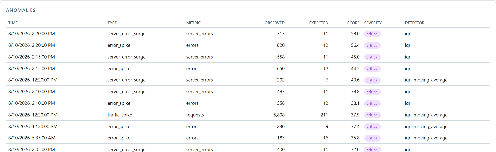
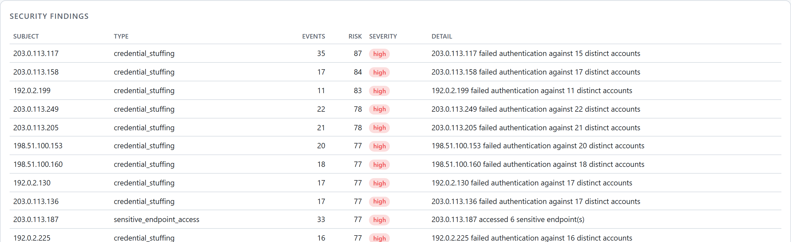

# Big Data Log Analytics Platform

A production-grade Python platform for ingesting, parsing, validating, normalising,
de-duplicating, analysing and serving very large volumes of application, server,
network and security logs.

It is a data-processing *product*, not a log parser: streaming ingestion that never
loads a dataset into memory, a canonical schema every source converges on, a
dead-letter queue so nothing is ever silently dropped, columnar storage with
partition pruning, statistical anomaly detection, security analytics with risk
scoring, a safe query language, a REST API, a dashboard and a CLI.

```
592 tests · 87 % coverage · ruff clean · mypy --strict clean · bandit clean
```

---

## Table of contents

- [What it does](#what-it-does)
- [Architecture](#architecture)
- [Installation](#installation)
- [Quick start](#quick-start)
- [Configuration](#configuration)
- [CLI](#cli)
- [REST API](#rest-api)
- [Dashboard](#dashboard)
- [Docker](#docker)
- [Performance](#performance)
- [Security](#security)
- [Testing](#testing)
- [Extending the platform](#extending-the-platform)
- [Project layout](#project-layout)
- [Roadmap](#roadmap)

---

## What it does

| Capability | Detail |
| --- | --- |
| **Ingestion** | Files (`.log .txt .csv .tsv .json .jsonl .gz`), directories, PostgreSQL / MySQL / SQLite, paginated REST APIs. Pluggable — new sources register themselves. |
| **Formats** | JSON/JSONL, Apache & Nginx access logs (common + combined), Nginx error logs, syslog (RFC 3164/5424), `logfmt`, CSV/TSV, plain text, and operator-defined regex formats. Auto-detected from a sample. |
| **Canonical schema** | 24 fields, Pydantic-validated, with a deterministic `event_id` that makes re-ingestion idempotent. |
| **Data quality** | Missing/invalid timestamps, bad IPs, out-of-range status codes, encoding damage, control characters, oversized fields — repaired where possible, dead-lettered with a reason where not. |
| **Deduplication** | Four strategies (none / `event_id` / content hash / configurable fields) over a bounded LRU, so memory stays flat on any dataset size. |
| **Analytics** | Error analysis, HTTP status distribution, latency percentiles (P50/P95/P99), traffic and top-N, per-service health, and time-series over six window sizes. |
| **Anomaly detection** | Z-score, trailing moving average, IQR (Tukey) and EWMA detectors, merged and ranked, with severity derived from both statistical strength and operational magnitude. |
| **Security analytics** | Brute force, credential stuffing, endpoint scanning, sensitive-endpoint access, scanner user-agents, request floods, and applications that log their own credentials — each with a 0-100 risk score and its evidence. |
| **Storage** | Hive-partitioned Parquet (zstd, dictionary-encoded) + JSONL/CSV, queried in place by DuckDB. Interface-based, so backends are swappable. |
| **Search** | A safe expression language (`service=payment AND status_code>=500`) compiled to bound SQL parameters — injection is structurally impossible, not filtered. |
| **API** | FastAPI with pagination, filtering, sorting, date ranges, scoped API-key auth, token-bucket rate limiting and strict security headers. |
| **Dashboard** | A single self-contained page: no CDN, no build step, hand-drawn SVG charts that satisfy a `default-src 'self'` CSP. |
| **Streaming** | A near-real-time processor that reuses the same stages but schedules them for latency: flush on size *or* age, a bounded live window for sub-second dashboards, and offsets acknowledged only after a durable flush. Kafka is one optional source; the processor takes any iterable. |
| **Operations** | Structured JSON logs with secret masking, Prometheus metrics, background jobs with retries, graceful shutdown, Docker Compose, GitHub Actions. |

---

## Architecture

```
                      ┌─────────────────────────────────────────┐
   files ─┐           │              Ingestion                  │
   dirs   ├──────────▶│  streaming sources, never materialised  │
   DBs    │           └────────────────────┬────────────────────┘
   APIs  ─┘                                │  RawRecord
                                           ▼
                       ┌──────────────────────────────────────┐
                       │   Parsing   (auto-detected format)   │
                       └────────────────────┬─────────────────┘
                                            │  LogEvent
        ┌───────────────────────────────────┼──────────────────────────┐
        ▼                                   ▼                          ▼
  ┌───────────┐   ┌──────────────┐   ┌─────────────┐   ┌────────────────────┐
  │  Cleaning │──▶│ Normalisation│──▶│  Enrichment │──▶│     Validation     │
  │  repair   │   │  comparable  │   │   masking   │   │  keep or reject    │
  └───────────┘   └──────────────┘   └─────────────┘   └─────────┬──────────┘
                                                                 │
                                          rejected ──────────────┤
                                              │                  ▼
                                              │        ┌────────────────────┐
                                              │        │   Deduplication    │
                                              │        └─────────┬──────────┘
                                              ▼                  ▼
                                   ┌────────────────┐  ┌────────────────────┐
                                   │ Dead-letter Q  │  │  Parquet (Hive)    │
                                   │ JSONL + reason │  │ year=/month=/day=  │
                                   └────────────────┘  └─────────┬──────────┘
                                                                 │
                     ┌───────────────────────────────────────────┼───────────┐
                     ▼                     ▼                     ▼           ▼
              ┌────────────┐      ┌────────────────┐    ┌────────────┐  ┌─────────┐
              │  DuckDB    │      │   Anomaly      │    │  Security  │  │ Search  │
              │  analytics │      │   detection    │    │  analytics │  │  DSL    │
              └──────┬─────┘      └────────┬───────┘    └──────┬─────┘  └────┬────┘
                     └─────────────────────┴───────────────────┴─────────────┘
                                           │
                        ┌──────────────────┼──────────────────┐
                        ▼                  ▼                  ▼
                  ┌──────────┐      ┌────────────┐     ┌───────────┐
                  │ REST API │      │ Dashboard  │     │  Reports  │
                  │ + cache  │      │ SVG, CSP   │     │ md/json   │
                  └──────────┘      └────────────┘     └───────────┘
```

Every stage is an independent, separately testable component behind an interface.
`docs/ARCHITECTURE.md` explains the dependency rules and why each boundary is
where it is.

---

## Installation

Requires Python 3.11+.

```bash
git clone https://github.com/mojtaba-py-code/big-data-log-analytics.git
cd big-data-log-analytics
python -m venv .venv && source .venv/bin/activate   # Windows: .venv\Scripts\activate
pip install -e ".[dev]"
```

Optional extras: `postgres`, `mysql`, `api` (HTTP ingestion), `celery`, `kafka`.

```bash
pip install -e ".[postgres,api]"
```

---

## Quick start

### The 60-second tour

```bash
python scripts/demo_end_to_end.py --records 200000 --serve
```

That generates a realistic dataset (with injected incidents and attacks), runs the
full pipeline, queries it, detects the anomalies, scores the attacks, writes a
report, proves no credential reached storage, and leaves the API and dashboard
running on <http://127.0.0.1:8000/dashboard>.

Real output from a 120,000-record run on a 2014 dual-core laptop — abridged, but
the numbers are not adjusted:

```text
STEP 2: Ingest: parse -> clean -> normalise -> enrich -> validate -> dedup -> Parquet
    lines read                         122,448
    records written                    118,783
    duplicates removed                 2,448
    records rejected                   1,217
    throughput                         1,239 records/s
    peak RSS                           303 MiB
    parquet size                       13.9 MiB (3.9x smaller)

    Nothing was silently dropped - every rejection is in the DLQ:
      unparseable                      1,217

STEP 6: Anomaly detection
    anomalies found                    70
      2026-08-10T21:15:00Z  server_errors  observed 1,407.0  expected 23.0  [critical]
      2026-08-10T12:30:00Z  errors         observed   387.0  expected 51.2  [critical]

    These correspond to the incidents injected into the dataset, found
    without any labels or training data.

STEP 8: Search
      level=ERROR                        10,962 matches in    129 ms
      status_code>=500                    9,428 matches in     84 ms
      service=auth AND status_code=401      286 matches in     88 ms
      endpoint~/api/v1/*                112,791 matches in    115 ms

STEP 10: Verify: no secrets reached storage
    injected credentials               4
    found in Parquet                   none - all redacted on ingest
    redaction markers present          True

  Demo complete in 114.4 s
```

### Or step by step

```bash
loganalytics generate data/raw/app.log -n 500000 --format json
```

```bash
loganalytics ingest data/raw/app.log
```

```bash
loganalytics analyze --hours 24 --window 15m
```

```bash
loganalytics search "service=payment AND status_code>=500" -n 20
```

```bash
loganalytics report --daily --format markdown -o report.md
```

```bash
loganalytics serve
```

---

## Configuration

Three layers, in increasing precedence: **built-in defaults → YAML/JSON file →
environment variables**.

```bash
export LOGA_CONFIG_FILE=configs/default.yaml
export LOGA_STORAGE__DATA_ROOT=/var/lib/loganalytics
export LOGA_API__API_KEYS='["<32-byte-random-key>"]'
```

The pattern is `LOGA_<SECTION>__<KEY>` (two underscores). See
[`configs/default.yaml`](configs/default.yaml) for every option with comments, and
[`.env.example`](.env.example) for the secrets.

**Credentials never live in a config file.** Every secret field is a
`SecretStr`, so it renders as `**********` in logs, dumps, `GET /admin/config`
and validation errors.

Setting `environment: production` activates a set of refusals — the process will
not start with authentication disabled, masking off, wildcard CORS, docs exposed
or `DEBUG` logging:

```bash
loganalytics config validate --environment production
```

---

## CLI

```
loganalytics ingest <source>       ingest a file, directory, URL or database DSN
loganalytics process --input DIR   batch-process a directory in parallel
loganalytics analyze               compute analytics over a window
loganalytics search "<query>"      search with the expression language
loganalytics report --daily        generate a report (markdown/json)
loganalytics stats                 dataset and platform statistics
loganalytics generate <file>       synthesise a realistic dataset
loganalytics stream                consume a live stream (Kafka or a tailed file)
loganalytics serve                 run the API and dashboard
loganalytics plugins               list registered parsers/sources/backends
loganalytics config show|validate  inspect or validate configuration
loganalytics apikey create|list|revoke
loganalytics dlq stats|show        inspect the dead-letter queue
loganalytics job run <name>        run a background job synchronously
```

Every command takes `--json` for machine-readable output on stdout (logs go to
stderr, so `loganalytics stats --json | jq` works). Exit codes: `0` success,
`1` failure, `2` invalid usage, `3` completed with an elevated rejection rate.

---

## REST API

```bash
curl -H "X-API-Key: $KEY" 'http://localhost:8000/analytics/overview?hours=24'
```

| Endpoint | Purpose |
| --- | --- |
| `GET /health` · `/health/live` · `/health/ready` | health, liveness, readiness |
| `GET /metrics` | Prometheus exposition |
| `GET /stats` | dataset size and shape |
| `GET /logs` | filtered, sorted, paginated records |
| `GET /logs/search?q=...` | the query language (`&explain=true` shows the compiled predicate) |
| `GET /logs/{event_id}` | one record |
| `GET /logs/export/stream` | streamed NDJSON export |
| `GET /analytics/overview` · `errors` · `traffic` · `latency` · `status-codes` · `services` · `timeseries` · `anomalies` · `security` | analytics views |
| `GET /reports/daily` · `/reports/summary` | reports as JSON, Markdown or HTML |
| `GET/POST/DELETE /jobs` | background jobs |
| `GET /admin/*` | configuration, plugins, runs, cache, API keys |

Full reference with parameters, examples and error codes: [`docs/API.md`](docs/API.md).

### Search language

```
service=payment AND level=ERROR
status_code>=500 AND NOT endpoint~/health
level=ERROR,CRITICAL                       # implicit IN
endpoint~/api/v1/*                         # wildcard
ip=192.0.2.5 "connection refused"          # field + free text
(service=api OR service=auth) AND status>=400
```

Field names are checked against an allow-list at parse time and every value
leaves as a bound `?` parameter. There is no code path in which request text
reaches the SQL string.

---

## Dashboard

`http://localhost:8000/dashboard`

Headline tiles (requests, errors, error rate, P95/P99 latency, active services,
anomalies, suspicious events), time-series charts, status distribution, top
endpoints and addresses, per-service health, anomalies and security findings —
with time-window, bucket-size and service filters and optional auto-refresh.

It is one HTML file with hand-written SVG charting and no external requests, so
the API can keep a strict `default-src 'self'` CSP. A dashboard that renders
attacker-controlled log text is exactly where a relaxed CSP turns a stored XSS
into an account takeover; every value is inserted with `textContent`.

Below is the dashboard over the demo dataset — 117,796 records ingested from
120,000 generated lines. The three spikes in the charts are the incidents the
generator injected, and they are what the detectors below found.


Anomalies are found without labels or training data — each row carries the
observed value, what was expected, a score and which detector fired:



Security analytics scores each subject rather than just listing matches:



---

## Docker

```bash
cp .env.example .env      # set POSTGRES_PASSWORD and LOGA_API_KEYS
docker compose up
```

Brings up `api`, `postgres` and `redis`; `--profile workers` adds a worker and
`--profile streaming` adds Kafka. The image is a multi-stage build that ships no
compiler, runs as an unprivileged user, declares its writable volumes so the root
filesystem can be read-only, and health-checks `/health/live`.

Deployment guidance, including Kubernetes manifests and reverse-proxy notes:
[`docs/DEPLOYMENT.md`](docs/DEPLOYMENT.md).

---

## Performance

Measured on the development machine — a 2014 dual-core laptop (i5-4210U,
4 threads, 6 GB RAM, Windows 10, Python 3.12), which is a deliberately
unflattering baseline:

| Stage | Throughput | Per record |
| --- | ---: | ---: |
| Full pipeline (ingest → Parquet) | 1,122 rec/s · 0.51 MB/s | 891 µs |
| Parse (JSON) | 3,569 rec/s | 280 µs |
| Clean | 39,458 rec/s | 25 µs |
| Normalise | 13,170 rec/s | 76 µs |
| Enrich (masking) | 4,175 rec/s | 240 µs |
| Validate | 74,361 rec/s | 13 µs |
| Deduplicate | 129,910 rec/s | 8 µs |

Analytical queries over the resulting 100 k-record dataset:

| Engine | Group-by + P95 | Throughput |
| --- | ---: | ---: |
| **DuckDB** (over Parquet) | 35 ms | 2.9 M rec/s · 342 MB/s |
| Polars (read + aggregate) | 708 ms | 140 k rec/s |
| pandas (read + aggregate) | 817 ms | 121 k rec/s |

Parquet + zstd compressed the 45 MB JSONL source to 11.9 MB (**3.8x**), and every
analytics view answered in **28-172 ms**.

Memory is flat: ingesting 10x the data adds tens of megabytes, not 10x the RSS,
because the pipeline is a chain of generators and the writer buffers by row-group.

```bash
python benchmarks/benchmark.py --records 1000000 --output benchmarks/results/run.json
```

Method, engine trade-offs and tuning advice: [`docs/PERFORMANCE.md`](docs/PERFORMANCE.md).

---

## Security

Security is a first-class requirement, not a checklist at the end.

- **Secret masking before storage** — API keys, bearer tokens, JWTs, vendor keys,
  private keys, passwords and e-mail addresses are redacted on ingest, so a stolen
  Parquet file or backup contains no credential. Verified by tests that grep the
  written bytes.
- **Injection is structurally impossible** — the search language compiles to an
  AST; identifiers come from an allow-list and every value is a bound parameter.
  Even the list of Parquet files being scanned is bound, not interpolated.
- **Path traversal** — every externally supplied path is resolved against
  allow-listed roots, with symlink, NUL-byte, ADS and Windows device-name guards.
- **SSRF** — HTTP ingestion resolves DNS and rejects private, loopback,
  link-local and reserved addresses, and re-validates every redirect hop.
- **AuthN/AuthZ** — API keys compared in constant time against SHA-256 hashes;
  `read`/`write`/`admin` scopes; keys stored hashed and shown once.
- **Rate limiting** — per-credential token bucket; `X-Forwarded-For` is ignored
  unless the peer is a configured trusted proxy.
- **Denial of service** — bounded line length, decompression-bomb limits, bounded
  dedup memory, query complexity limits, ReDoS-resistant patterns.
- **No information leakage** — one error envelope, generic public messages, full
  detail (masked) only in the logs, correlated by request id.

Threat model, control-by-control detail and reporting process:
[`docs/SECURITY.md`](docs/SECURITY.md).

---

## Testing

```bash
pytest                        # fast suite (unit + integration + security)
pytest -m unit                # 211 fast isolated tests
pytest -m security            # 100 security regression tests
pytest -m performance         # streaming/memory properties (slow)
pytest --cov=app --cov-report=html
```

592 tests, 87 % branch coverage:

| Suite | What it proves |
| --- | --- |
| **unit** | Parsers, validators, transformers, dedup, masking, config, time handling, search compilation. |
| **integration** | The pipeline end to end, Parquet round-trips, partition pruning, DuckDB, metadata, cache, workers, the API, the CLI. |
| **security** | SQL injection, SQL-literal escaping, path traversal, SSRF, auth, scopes, principal caching, rate limiting, secret leakage, resource exhaustion, response hardening. |
| **performance** | Memory stays flat as input grows; throughput does not collapse with scale; pruning beats a full scan. |

Quality gates, all currently clean:

```bash
ruff check app tests && ruff format --check app tests
mypy app                      # --strict
bandit -c pyproject.toml -r app
pip-audit
```

---

## Extending the platform

Every extension point is a registry; adding a capability never means editing a
dispatch chain.

```python
from app.parsers.base import LogParser, ParseContext, parser_registry

@parser_registry.register("my-format")
class MyParser(LogParser):
    name = "my-format"
    confidence = 80

    def can_parse(self, sample): ...
    def parse(self, raw, context): ...
```

The same pattern applies to ingestion sources, storage backends, deduplication
strategies, anomaly detectors, cache backends and background jobs. A custom
text format needs no code at all — declare a regex in configuration.

---

## Project layout

```
app/
├── core/              config, logging, masking, paths, hashing, retry, metrics, registry
├── models/            LogEvent, enums, analytics and result models
├── ingestion/         file, directory, database and HTTP sources
├── parsers/           JSON, access, syslog, logfmt, CSV, custom regex + detection
├── validation/        rule-based validation and the dead-letter queue
├── transformation/    cleaning, normalisation, enrichment (masking)
├── deduplication/     strategies and bounded membership tracking
├── pipeline/          orchestration, graceful shutdown, parallel execution
├── streaming/         near-real-time processor, live window, optional Kafka
├── storage/           Parquet/JSONL/CSV, partitioning, DuckDB engine, metadata
├── analytics/         aggregation engine, statistics, security analytics, reports
├── anomaly_detection/ detectors and the scanning service
├── search/            query language and search service
├── cache/             memory and Redis backends
├── workers/           job queue, registered jobs, optional Celery
├── api/               FastAPI app, routers, security, errors, dependencies
├── dashboard/         self-contained HTML dashboard
├── cli/               Typer command-line interface
└── synthetic/         realistic log generator

tests/{unit,integration,security,performance}
docs/                  ARCHITECTURE, API, SECURITY, PERFORMANCE, DEPLOYMENT, CONTRIBUTING
benchmarks/            benchmark harness and results
scripts/               end-to-end demonstration
configs/               default and production configuration
```

---

## Roadmap

- Machine-learning anomaly detectors behind the existing `AnomalyDetector` interface
- Object-storage backends (S3/GCS/Azure) behind `StorageBackend`
- Iceberg/Delta table formats for time travel and schema evolution
- OpenTelemetry traces alongside the current structured logs and metrics
- Alerting sinks (webhook, PagerDuty, e-mail) driven by anomalies and findings
- Multi-tenancy: per-tenant partition prefixes and key scoping

---

## License

MIT — see [LICENSE](LICENSE).
